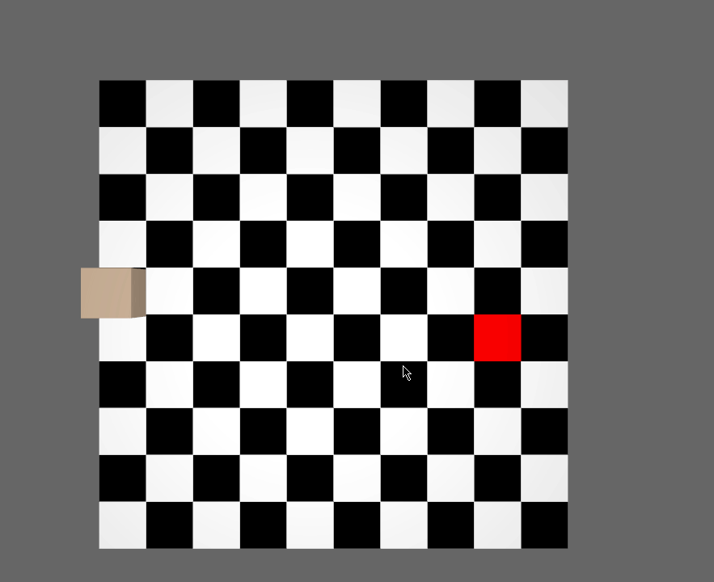

# a-star-prototype
Prototype for the a* pathfinding algorithm for Bevy game engine

## Roadmap
### Obstruction
- Right click - add wall :heavy_check_mark:
- Path cannot be constructed by using obstructed tiles :clock9:
- Path gets recalcualated on obstruction of one of its tiles :clock9:
- Cannot select an obstructed tile :clock9:
- When clicked on obstructed tile, find path to nearest unobstructed tile :clock9:

### Costs
- Add cost to different tiles :clock9:
- Find clicked space on tile :clock9:
- Set area costs with public method :clock9:

### Nav Mesh agent
- Provide Nav Mesh Agent API with different strategies implemented :clock9:
- Set Nav Mesh Agent to ignore costs :clock9:

### Nav Mesh
- Implement Nav Mesh instead of grid :clock9:
- Create Nav Mesh with bakeable mesh :clock9:
